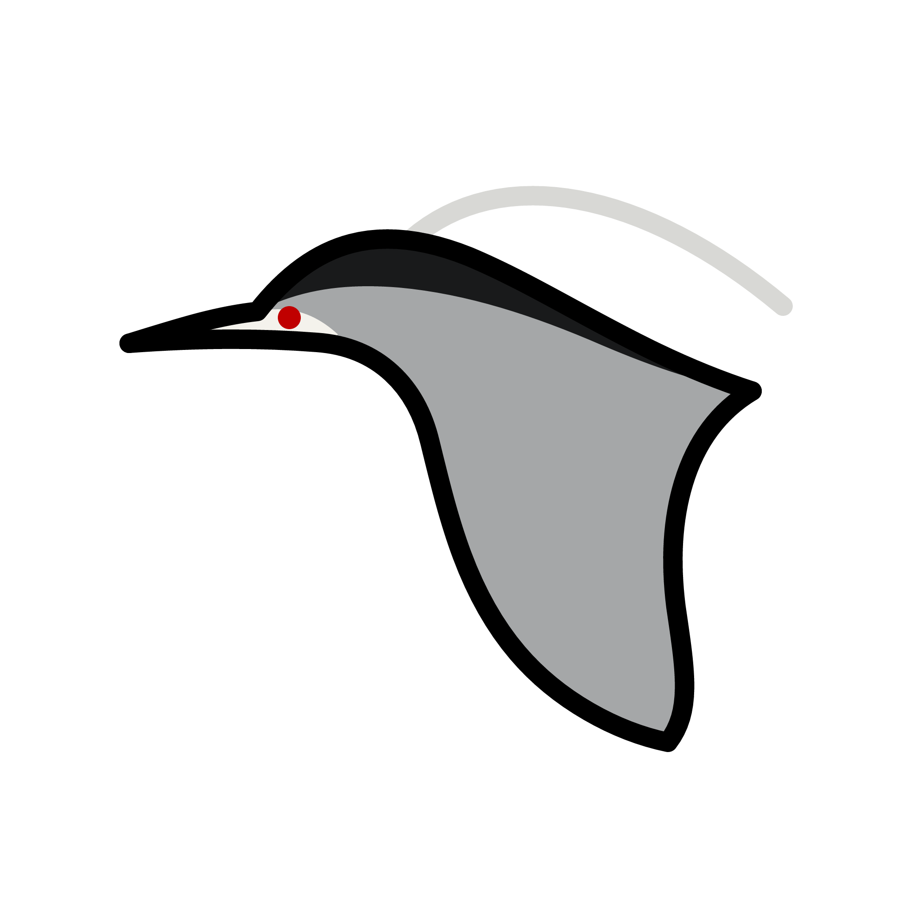

<br/>


An Open-Source AI Agent Application With MCP Based On Python

- Code Agent
- Worker Mode (In Development)
- Tool Calling
- Data Collection 

<br clear="right"/>

[](https://git.io/typing-svg)

<div align="center">
    <p>
        
        
        
        
        
        
    </p>
</div>

--- 

## 这是什么?

ProjectNeuro 是一个由AI虚拟主播[Neuro-sama](https://www.twitch.tv/vedal987)的粉丝开发的基于MCP与Tool Calling的开源Agent应用.  
但它不止可以作用于Coding，我们正在开发中的Worker Mode将会带给您不一样的体验

---

## 如何部署它?

### 源码部署:
如果你更习惯用命令行，或者想参与开发，可以用源码部署  

如果您是 Windows 用户，请根据如下步骤进行  

#### Step 1 --- 安装[Git](https://git-scm.com/)和[Python](https://www.python.org/)  

- 访问 https://www.python.org/ftp/python/3.14.7/python-3.14.7-amd64.exe 下载最新版 Python  

(待完善)  

- 访问 https://github.com/git-for-windows/git/releases/download/v2.55.0.windows.5/Git-2.55.0.5-64-bit.exe 下载最新版 Git  

(待完善)  

#### Step 2 --- 拉取源码  

Step 2.1: 通过Git拉取ProjectNeuro源代码  

```bash
git clone https://github.com/Fedal987/neurocode-py.git
```  

#### Step 3 --- 配置环境  

Step 3.1: 使用Python安装uv包管理器创建并激活虚拟环境  

```bash
pip install uv
cd neurocode.py
uv venv
.venv\\Scripts\\activate
```  

Step 3.2: 安装运行环境  

```bash
uv pip install -r requirements.txt
```  

Step 3.3:在`templates`目录中复制`config.toml.bak`到项目根目录并命名为`config.toml`作为配置文件  

Step 3.4: 填写配置文件中的内容  
```toml
[API_MANAGER]
BASE_URL = "https://api.siliconflow.cn/v1" # 可替换为你使用的实际Provider URL
API_KEY = "" # 在这里填写您Provider提供的API KEY
MODEL = "deepseek-ai/DeepSeek-V4-Flash" # 当前模型
TEMPREATURE = 0.7 # 大概率不用管
STREAM = true # 不用管

[REASONING]
ENABLED = true # 启用推理提示词和思考展示；关闭后仍使用共享工具调用 Agent
THINKING = true # 为支持该参数的 DeepSeek/SiliconFlow 模型启用思考模式
MAX_STEPS = 12 # 单次任务允许的最大模型执行轮数
EFFORT = "" # API 支持时可填写 low/medium/high；留空兼容更多服务商
AUTO_APPROVE = false # false 时，写文件和运行命令前要求用户确认
COMMAND_TIMEOUT = 60 # 命令执行超时时间（秒）
```  

#### Step 4 --- 运行

```bash
# 请确保您在ProjectNeuro的虚拟环境内
# 如未进入虚拟环境, 请先输入.venv\\Scripts\\activate
uv run neuro.py
```

## TODO list:

P0:
- 修复流式异常生成器的 `NameError`
- 更新README
- 将配置读取移出import阶段

P1:
- 统一两套api实现
- 将工具实现从 `Agent` 中拆出
- 合并同步和流式Agent循环
- 拆分终端UI和入口
- 修复翻译问题

P2:
- 完善 `pyproject.toml` 和入口
- 增加依赖锁定与自动发布流程
- 补全skills_handler和plugin_handler

## 开发人员名单

- [Fedal987](https://github.com/Fedal987) (项目主策划、项目文档编辑者、主要开发者)
- [いじちにじか](https://github.com/Ij1chi-Nijika)  (主要开发者、代码审查、项目测试)

## 鸣谢

- [DeepSeek](https://www.deepseek.com) deepseek-v3-0324发布提供灵感
- [MaiBot](https://github.com/Mai-with-u/MaiBot) 提供部分思路
- GitHub 提供代码分发服务
- 画师 [paccha](https://www.pixiv.net/users/96121842) 制作的Neuro-sama绘图
- HeronStudio 开发组成员

## LICENSE

本项目采用MIT License开源，对项目的使用，开发以及二次分发请遵守MIT License的规则 
 
<br/>

<p align="center">
    <a href="https://www.heronstudio.cc/">
        
    <a/>
    <br/>
    <b>Powered By HeronStudio</b>
    <br/>
    <b>Contact: fedal987@fedal.icu</b>
</p>
